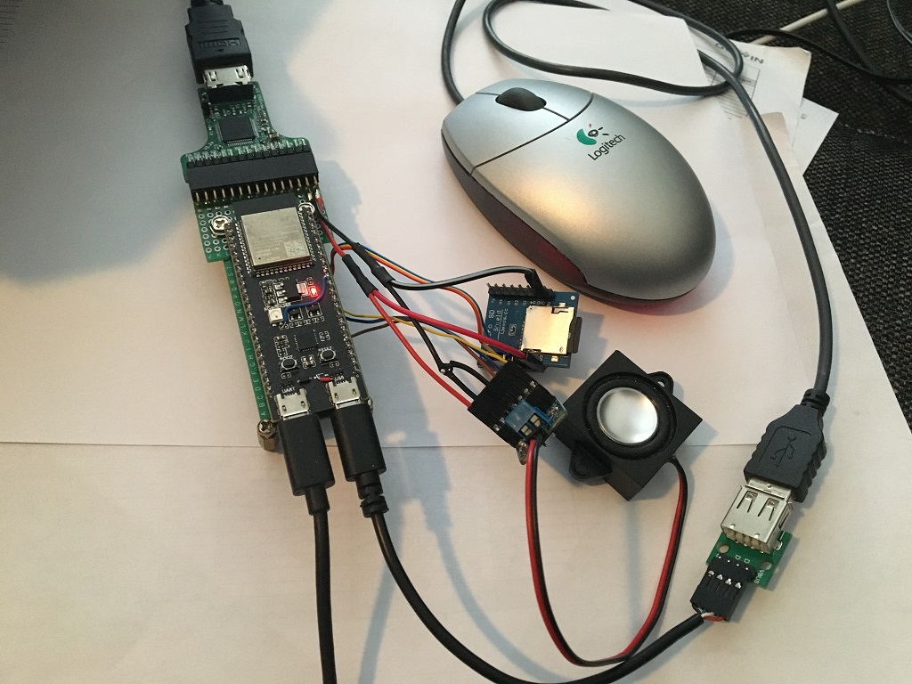
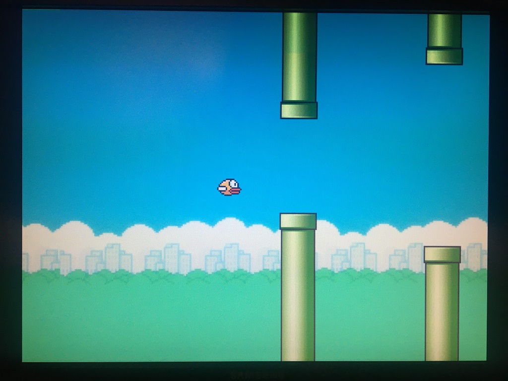

# ESP_Control_Deck
***
An ESP32-S3 devboard + 16-bit (RGB565) DVI-module + USB-mouse + flappy bird implementation in lvgl.
 
 
Flappy Bird implementation not fully completed yet.
 

    TODO: 
    
    collision detection with pipes
    import font
    count and display points
    game levels
    add sound (mp3 playback)
    etc.

***
PROTOTYPE:

 

